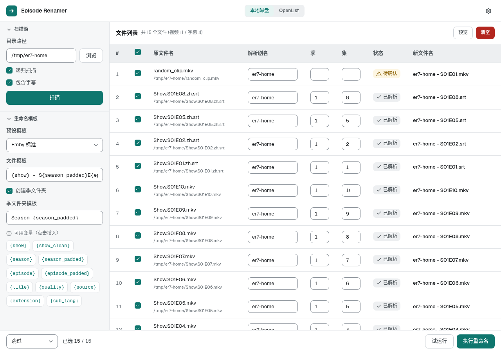
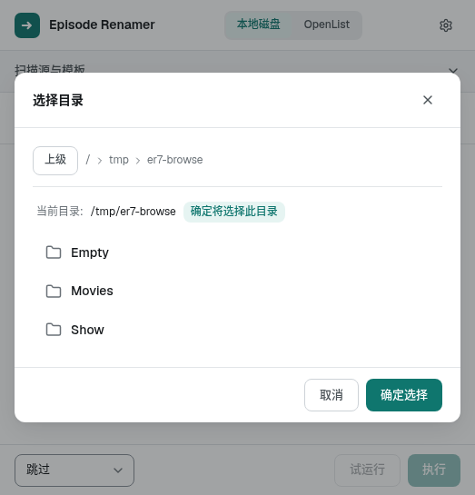
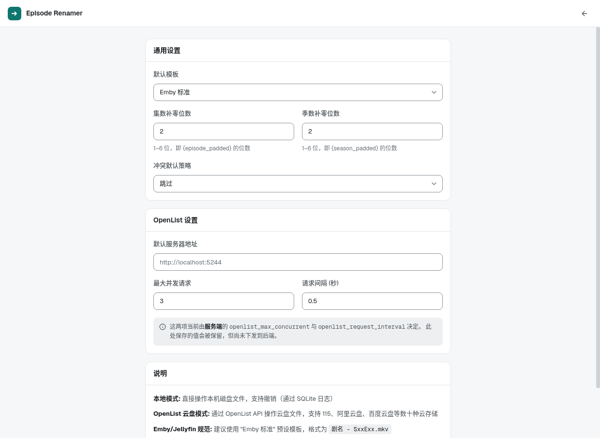

<!-- generated-by: gsd-doc-writer -->
# Episode Renamer

电视剧 / 番剧自动化重命名工具：同时处理**本地磁盘**与 **OpenList 云盘**两类文件源，按模板批量重命名，并可为本地文件写出符合 Emby / Jellyfin 规范、由 TMDB 元数据驱动的 NFO。


## ✨ 功能特性

- **双数据源** — 本地磁盘与 OpenList 云盘共用同一套解析、模板与重命名流程
- **智能解析** — 正则识别 `S01E01`、`第2季第3话`、`[03]`、`01~`、`sbtj03` 等多种集号写法，并支持从父文件夹继承剧名与季号
- **模板系统** — 5 个内置预设 + 自定义模板，支持 `{show}` `{season_padded}` `{quality}` 等变量
- **季文件夹** — 可选的目录模板（如 `Season {season_padded}`），重命名时自动把文件归入对应季目录
- **试运行（Dry Run）** — 先预览再执行，执行前不动任何文件
- **冲突策略** — `skip` / `abort` / `rename_dup` / `overwrite` 四种目标已存在时的处理方式
- **TMDB 元数据** — 按剧名匹配 TMDB，可为模板提供 `{title}`，并生成 tvshow / season / episode 三级 NFO（仅本地源）
- **Docker 一键部署** — 多阶段构建（前端产物打进后端镜像），自带健康检查

## 🖥️ 界面预览

> 主工作区



> OpenList 目录浏览



> 设置页



## 🛠️ 技术栈

| 层  | 技术                                                          |
| -- | ----------------------------------------------------------- |
| 前端 | Vue 3 + Pinia + Vue Router（hash 模式）+ Tailwind CSS 4 + Lucide Icons |
| 后端 | Python 3.12 + FastAPI + Pydantic 2 + httpx + uvicorn         |
| 部署 | Docker 多阶段构建 + docker-compose（FastAPI 直接托管前端静态产物）          |

## 🚀 快速开始

### 方式一：Docker 部署（推荐）

```bash
# 克隆项目
git clone https://github.com/xiaobili/episode-renamer.git
cd episode-renamer

# 编辑 docker-compose.yml，把 volumes 里的路径改成你的媒体目录
# volumes:
#   - /your/media/path:/media:ro

# 一键构建并启动
docker compose up -d --build
```

浏览器访问 `http://localhost:6969` 即可使用（compose 把容器的 6969 端口映射到宿主机同名端口）。

### 方式二：本地开发

**前置条件**：Python 3.12、Node.js 18+（与 Dockerfile 使用的 `python:3.12-slim`、`node:20-alpine` 一致）。

```bash
# 克隆项目
git clone https://github.com/xiaobili/episode-renamer.git
cd episode-renamer

# --- 后端（默认监听 8000）---
cd backend
python3 -m venv .venv
source .venv/bin/activate    # Windows: .venv\Scripts\activate
pip install -r requirements.txt
python run.py                # http://localhost:8000

# --- 前端（新终端）---
cd frontend
npm install
npm run dev                  # http://localhost:5173
```

`frontend/vite.config.js` 已把 `/api` 代理到 `http://localhost:8000`，因此前端开发服务器无需额外配置跨域。

> 注意本地开发与容器的端口不同：`python run.py` 读 `config.py` 的 `PORT`（默认 `8000`），而容器内由 Dockerfile 的 `CMD` 显式传入 `--port 6969`。

## ⚙️ 配置

### 后端环境变量

配置由 `backend/app/config.py` 的 `Settings`（pydantic-settings）读取，变量名大小写不敏感。

| 变量                          | 默认值         | 说明                                              |
| --------------------------- | ----------- | ----------------------------------------------- |
| `HOST`                      | `0.0.0.0`   | 后端监听地址                                          |
| `PORT`                      | `8000`      | 后端监听端口（`python run.py` 使用）                        |
| `DEBUG`                     | `true`      | 为真时 uvicorn 以 `reload=True` 启动                    |
| `DB_PATH`                   | `data/app.db` | 预留的数据文件路径（当前代码未读取此配置）                           |
| `DEFAULT_SEASON`            | `1`         | 未解析出季号时 `{season}` 的回退值                          |
| `EPISODE_PAD_DIGITS`        | `2`         | `{episode_padded}` 的补零位数                        |
| `SEASON_PAD_DIGITS`         | `2`         | `{season_padded}` 的补零位数                         |
| `OPENLIST_MAX_CONCURRENT`   | `3`         | OpenList 扫描的最大并发数                               |
| `OPENLIST_REQUEST_INTERVAL` | `0.5`       | OpenList 请求间隔（秒）                                |
| `TMDB_API_KEY`              | 空字符串        | 为空即「未配置」，TMDB 功能整体降级为 disabled，且不发任何网络请求        |
| `TMDB_LANGUAGE`             | `zh-CN`     | TMDB 查询语言                                       |
| `TMDB_ENABLED`              | `true`      | TMDB 服务端总开关                                     |
| `TMDB_TIMEOUT`              | `10.0`      | TMDB 请求超时（秒）                                    |
| `TMDB_CACHE_TTL`            | `3600`      | TMDB 结果缓存 TTL（秒）                                |

把变量写进 `.env` 文件或直接通过环境变量传入。`env_file` 是相对**当前工作目录**解析的，从 `backend/` 启动时对应 `backend/.env`：

```bash
PORT=8000
DEBUG=false
TMDB_API_KEY=your_tmdb_key
```

> 容器部署请通过 `docker-compose.yml` 的 `environment:` 段传入。`.dockerignore` 排除了 `.env`，构建镜像时不会把它复制进镜像。

### OpenList 集成

1. **设置页** — 填入 OpenList 服务器地址（如 `http://your-openlist:5244`，实际地址随你的部署而定）与账号密码（支持两步验证码）<!-- VERIFY: OpenList 服务器地址与端口随部署环境而定，仓库内无固定值 -->
2. **工作区 OpenList 页签** — 登录后选择 mount 点 → 浏览进入具体子目录 → 扫描 → 重命名

> 🔒 前端强制要求先进入**子目录**才允许扫描或选择：根目录会被直接拒绝，避免一次拉取整个网盘。

### TMDB 集成

TMDB 开关与 Key 的优先级规则（见 `backend/app/api/tmdb.py` 的 `resolve_tmdb_client`）：

- **Key / 语言**：请求体或请求头 > `.env`
- **开关**：请求中显式关闭 > 服务端 `TMDB_ENABLED` > 开启

空字符串一律视为「未提供」，会回退到服务端配置；`/api/tmdb/*` 在配置不可用时返回 400，而 `/api/rename/*` 只会静默降级，**TMDB 永不阻断重命名**。

## 📦 模板与变量

内置预设（`backend/app/models/template.py` 的 `TEMPLATE_PRESETS`，经 `GET /api/presets` 暴露）：

| id             | 名称    | 文件模板                                            | 季文件夹模板                  |
| -------------- | ----- | ----------------------------------------------- | ----------------------- |
| `emby_standard` | Emby 标准 | `{show} - S{season_padded}E{episode_padded}{extension}` | `Season {season_padded}` |
| `chinese`      | 中文友好  | `{show} - 第{season}季第{episode}集{extension}`     | `第{season}季`             |
| `with_title`   | 带标题   | `{show} - S{season_padded}E{episode_padded} - {title}{extension}` | `Season {season_padded}` |
| `anime_simple` | 番剧简化  | `{show} - {episode_padded}{extension}`          | （空）                     |
| `full_info`    | 完整信息  | `{show} S{season_padded}E{episode_padded} [{quality}]{extension}` | `Season {season_padded}` |

可用变量（`backend/app/core/template.py` 的 `_resolve_variable`）：

```
{show}              剧名
{show_clean}        剧名（已剔除非法文件名字符）
{season}            季号（缺失时用 DEFAULT_SEASON）
{season_padded}     季号补零
{episode}           集号
{episode_padded}    集号补零
{title}             集标题（TMDB 匹配后可用）
{quality}           画质标签，如 1080p / 4K
{source}            来源标签，如 WEB-DL / BDRip
{extension}         原扩展名（含点号），如 .mkv
{sub_lang}          字幕语言后缀
```

模板未包含 `{extension}` 时会自动追加原扩展名；未知变量会在 `POST /api/validate` 中报错。

## 📂 项目结构

```
episode-renamer/
├── backend/                        # FastAPI 后端
│   ├── app/
│   │   ├── api/                    # REST 路由
│   │   │   ├── scanner.py          # /api/scan、/api/browse
│   │   │   ├── parser.py           # /api/parse、/api/parse/batch
│   │   │   ├── renamer.py          # /api/rename/*、/api/files
│   │   │   ├── template.py         # /api/presets、/api/validate
│   │   │   ├── openlist.py         # /api/openlist/*
│   │   │   └── tmdb.py             # /api/tmdb/*
│   │   ├── core/                   # 核心引擎
│   │   │   ├── parser.py           # 文件名解析（正则 + 父文件夹剧名）
│   │   │   ├── template.py         # 模板变量渲染与校验
│   │   │   ├── local_scanner.py    # 本地目录扫描
│   │   │   ├── local_renamer.py    # 本地批量重命名（含冲突策略）
│   │   │   ├── openlist_client.py  # OpenList HTTP 客户端
│   │   │   ├── openlist_scanner.py # 云盘并发扫描
│   │   │   ├── openlist_renamer.py # 云盘分组批量 move
│   │   │   ├── tmdb_client.py      # TMDB API 客户端
│   │   │   ├── tmdb_resolver.py    # 剧集匹配与缓存
│   │   │   ├── nfo_writer.py       # NFO 决策与落盘
│   │   │   └── utils.py            # 扩展名 / 补零 / 字幕语言等工具
│   │   ├── models/                 # Pydantic 模型（api / file / template / tmdb / nfo / openlist）
│   │   ├── config.py               # Settings 与默认值
│   │   └── main.py                 # FastAPI 应用、路由挂载与前端静态托管
│   ├── tests/                      # pytest 套件
│   ├── pytest.ini
│   ├── run.py                      # 本地启动入口
│   └── requirements.txt
├── frontend/                       # Vue 3 前端
│   ├── src/
│   │   ├── api/                    # axios 封装（baseURL: /api）
│   │   ├── components/             # 组件（含 layout/ 与 ui/）
│   │   ├── router/                 # vue-router（hash 模式）
│   │   ├── stores/                 # Pinia stores
│   │   ├── views/                  # HomeView / SettingsView
│   │   ├── App.vue
│   │   ├── main.js
│   │   └── style.css               # Tailwind + 设计 token
│   ├── scripts/                    # check-*.mjs 前端判据脚本
│   ├── vite.config.js
│   └── package.json
├── screenshot/                     # README 截图
├── Dockerfile                      # 多阶段构建
└── docker-compose.yml
```

## 🔌 API 速览

所有业务接口前缀 `/api`（另有 `/health`）。完整交互式文档见 `http://localhost:8000/docs`（容器内为 `http://localhost:6969/docs`）。

| 方法     | 路径                        | 说明                     |
| ------ | ------------------------- | ---------------------- |
| POST   | `/api/scan`               | 扫描本地目录或 OpenList 目录     |
| POST   | `/api/browse`             | 浏览本地目录（返回子目录列表）        |
| POST   | `/api/parse`              | 解析单个文件名                |
| POST   | `/api/parse/batch`        | 批量解析文件名                |
| POST   | `/api/rename/preview`     | 生成重命名预览（含 TMDB / NFO 字段） |
| POST   | `/api/rename/execute`     | 执行重命名                  |
| POST   | `/api/rename/dry-run`     | 试运行重命名，不落盘             |
| GET    | `/api/files`              | 获取后端缓存的扫描文件列表          |
| DELETE | `/api/files`              | 清空后端缓存的扫描文件列表          |
| GET    | `/api/presets`            | 获取预设模板列表               |
| POST   | `/api/validate`           | 校验模板变量                 |
| POST   | `/api/openlist/login`     | OpenList 登录            |
| POST   | `/api/openlist/test`      | 测试 OpenList 连接（失败不抛错）   |
| GET    | `/api/openlist/status`    | 查询 OpenList 连接状态       |
| GET    | `/api/openlist/mounts`    | 获取 mount 点列表            |
| POST   | `/api/openlist/logout`    | 断开 OpenList 连接         |
| POST   | `/api/openlist/browse`    | 浏览云盘子目录                |
| GET    | `/api/tmdb/test`          | 测试 TMDB 配置（返回可读状态）     |
| GET    | `/api/tmdb/search`        | 搜索剧集                   |
| GET    | `/api/info`               | 应用名称、版本与状态             |
| GET    | `/health`                 | 健康检查                   |

前端构建产物存在时，`GET /` 与 `GET /{full_path:path}` 会由 FastAPI 直接托管 SPA。

## 🧪 测试

```bash
# 后端单元测试（pytest）
cd backend
pip install -r requirements-dev.txt   # 仅含 pytest
pytest

# 前端机械判据（零依赖 node 脚本）
cd frontend
npm run check                         # 等价于 node scripts/check-all.mjs
```

后端用例位于 `backend/tests/`，覆盖解析补零、模板标题、重命名路由、TMDB 客户端与解析器、NFO 决策与落盘。前端 `scripts/check-*.mjs` 覆盖设置 schema、刮削门控、重命名请求体、SFC 可编译性与工作区门控，任一失败即非零退出。
